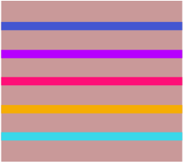
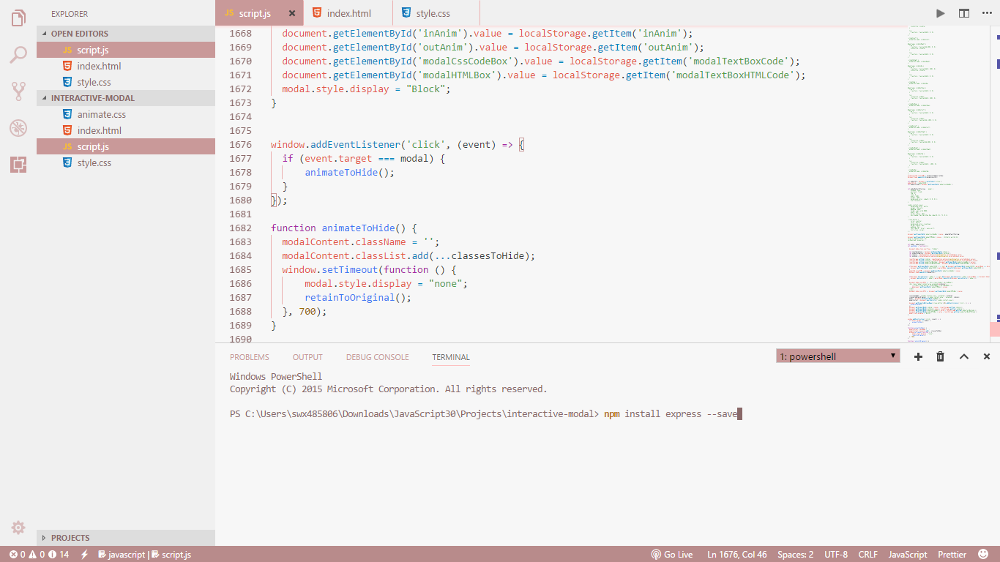
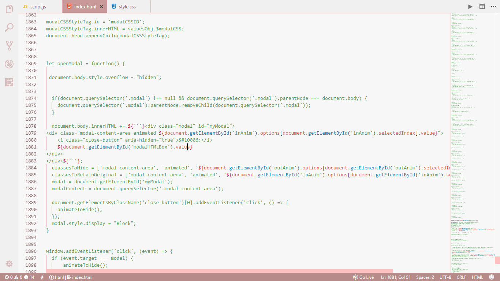
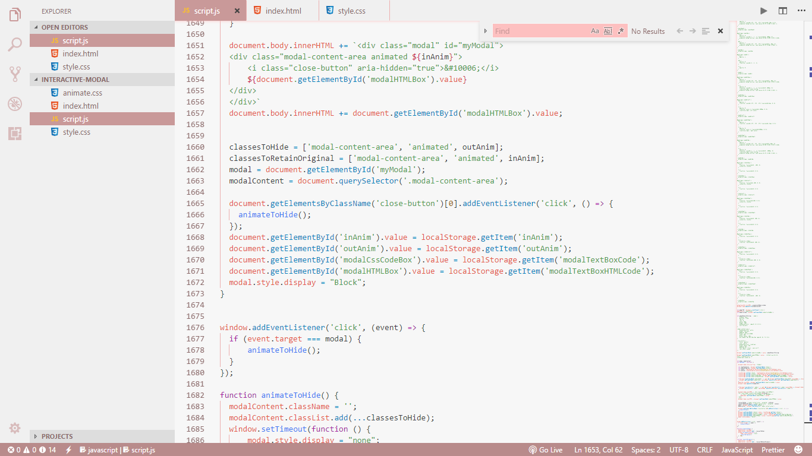
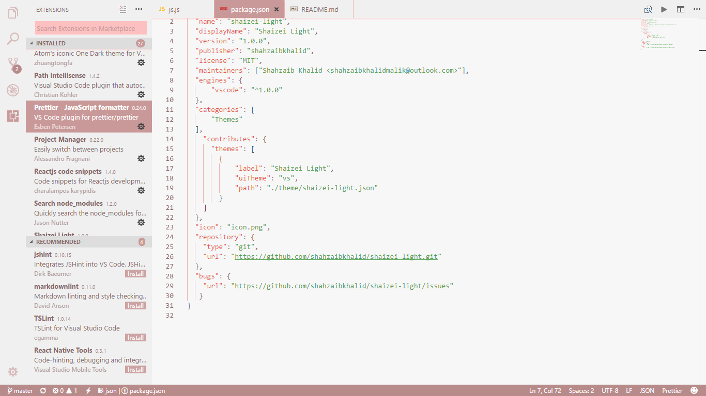

  
  <h1 align="center">Shaizei Light</h1>

Shaizei Light is a light Visual Studio Code Theme, heavily inspired by minimalism, sleekness and rosy-brown color.

### Design
This is how the design looks like:

### License
Shaizei Light is licensed under the [MIT License](https://github.com/shahzaibkhalid/shaizei-light/blob/master/LICENSE.txt).

Copyright (c) 2017 Shahzaib Khalid